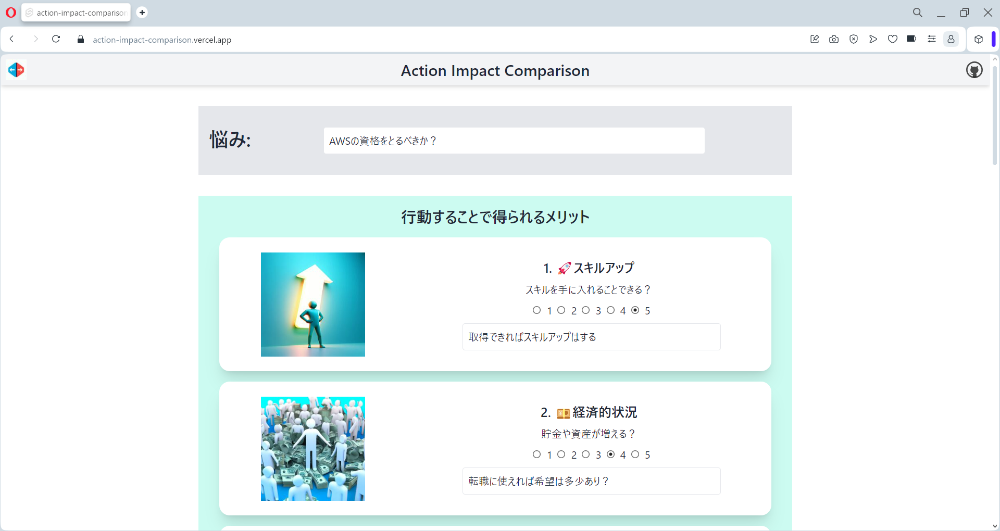
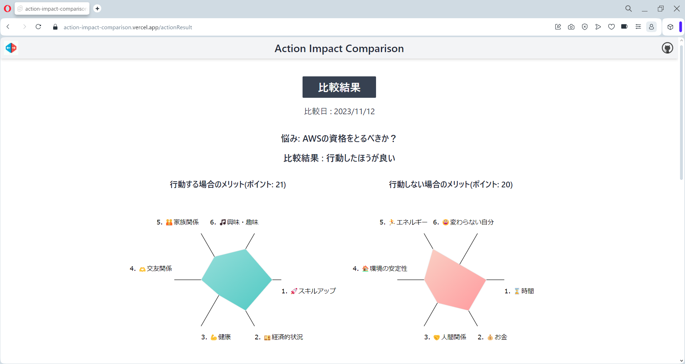

# action-impact-comparison

## Overview

悩み事に対して、行動する場合と行動しない場合を比較検討するためのアプリです。  
This application is used to compare and contrast the case of taking action and not taking action on a problem.

## Example

### 

### 

## Features

- SvelteKit
- TailwindCSS
- Image Creator from Microsoft Bing

## Creation Date

2023/11/11

## Purpose of creation

何かを決めるとき時間がかかってしまうのと、  
色々な項目で迷ってなんとなく決めていることがあるので、  
決定を早めるのと根拠を明確にしたくて作りました。  
機能面では、悩み事に対して行動する場合としない場合、  
どちらにもなんらかのメリットがあると感じるので、  
それぞれ点数を付けて比較できるようにしました。

## Usage

1. 悩みを入力する
2. 各項目に点数を付ける  
   　　 1：デメリットあり　 2：少しデメリットあり　 3：どちらでもない　 4：少しメリットあり　 5：メリットあり
3. 追記があればメモに記入
4. 「比較結果を見る」ボタンで結果を見る
